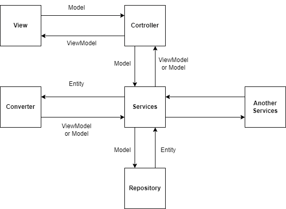

# proxtech-shop
Website selling laptop( spring-boot, spring data jpa, spring security, thymeleaf)

## Sơ đồ cấu trúc và luồng dữ liệu di chuyển

1. Các thành phần chính
* Sercuriy: Thành phần đứng trước chặn các request từ trình duyệt tới. Sử dụng Spring Sercurity
* Gateway: Tuy gọi là gateway nhưng thực tế nó là tổ hợp các controller được chia thành các package theo các chức năng (api, admin, etc...). Nó nhận các request được xác thực từ sercurity, tùy theo mục đích mà nó gọi các service cần thiết, xử lý data và return về View, json data hoặc điều hướng về các controller khác.
* Service: Các lớp chính xử lý hầu hết các logic trong ứng dụng (data, logic business, ... ). Các lớp này nhận data từ các controller hoặc service khác (ModelObject, Request Mapping Object, primitives variable, etc...). Sau khi nhận các object data này, tùy theo nghiệp vụ mà nó gọi tới Repository để xử lý data hoặc gọi tới các service khác. Dữ liệu trả về từ Repository thường là Entity vì thế trước khi đưa về controller nó sẽ xử lý các Entity đó thành các ViewModel Object hoặc Response Object (thường xử lý thông qua Converter hoặc convert thông qua contructor của ViewModel/Response Object.
* Repository: Thành phần xử lý dữ liệu tới database (Sử dụng interface JpaRepository của spring data jpa hoặc interface có chức năng tương đương tự custom).
* Entity: Các object mapping các thực thể trong database
* Models/Request: Các Object mapping data từ trình duyệt (view or api)
* ViewModel/Response: Các Object được return về View hoặc api
* Bean: Thành phần global trong ứng dụng (sử dụng anotation @Bean của sping để tạo ra). Nó là tập hợp các phương thức xử lý các dạng data mà có thể sử dụng trong toàn ứng dụng kể cả view.
2. Mối quan hệ của View, Controller, Service, Repository

3. Cấu trúc hoàn thiện


4. Thành phần bean
Trong 1 project có rất nhiều các loại dữ liệu cần sử dụng ở khắp mọi nơi mà không cần phải thực hiện các request để lấy. Các loại dữ liệu đó trong dự án này có thể là thông tin tài khoản của người dùng khi đăng nhập, danh sách các danh mục, thương hiệu,.. 
* Ví dụ như thông tin đăng nhập, ở một số màn hình chúng ta cần phải kiểm tra xem người dùng có đăng nhập chưa để hiện thị một số giao diện sao cho phù hợp.
  * Theo cách thông thường, ở controller chúng ta phải kiểm tra thông tin đăng nhập sau đó gắn 1 biến cờ (Flag) và return dữ liệu kèm Flag đó tới view, sau đó ở view check Flag rồi mới hiển thị giao diện.
  * Nếu như có nhiều màn hình cần thực hiện hành động đó sẽ làm mất thời gian + lặp lại code -> hệ thống kém tối ưu.
  * Nếu áp dụng bean thì việc kiểm tra đăng nhập là không cần thiết, ta chỉ cần tạo ra 1 bean xử lý check đăng nhập thì nó có thể sử dụng ở khắp mọi nơi trong ứng dụng.
```java
@Bean(name = "userLogin")
public IUserLogin userLogin() {
  return () -> {
    Authentication auth = SecurityContextHolder.getContext().getAuthentication();

    if (!(auth instanceof AnonymousAuthenticationToken)) {
      UserDetails userDetails = (UserDetails) auth.getPrincipal();
      return userRepo.getByUsername(userDetails.getUsername());
    } else {
      return null;
    }
  };
}
@Bean(name = "userLoginProfile")
public IUserLoginProfile userLoginProfile() {
  return () -> userService.loadProfile();
}
```
```java
// Class UserService
@Autowired
private IUserLogin userLogin;

@Override
public CustomUserModelView loadProfile() {
  User user = userLogin.get();
  if (user != null) {
    CustomUserModelView profile;
    Customer customer = customerRepo.findOneByUserId(user.getId());
    if (customer != null) {
      profile = new CustomUserModelView(user, customer, true);
    } else {
      profile = new CustomUserModelView(user, new Customer(), false);
    }
    return profile;
  } else {
    return null;
  }
}
```
```html
// Thymeleaf view
/* Đoạn code dưới thực hiện kiểm tra userLogin là customer thì hiển thị tên, không phải thì hiển thị user name */
<div class="flex gap-2 mr-4">
  <a th:href="${@profilePath}"
    th:with="userLogin = ${@userLoginProfile.get()}">
    <p th:text="${userLogin.isCustomer() ? userLogin.fullName : userLogin.username}"></p>
  </a> 
  <a th:href="${@profilePath} + '?repass=true'" class="box-user-item">
    <p>Đổi mật khẩu</p>
  </a>
  <form name="logoutForm" th:action="${@logoutPath}" method="post">
    <button class="box-user-item" type="submit">
      <p>Đăng xuất</p>
    </button>
  </form>
</div>
```
* Tương tự với các loại bean khác
```java
@Bean(name = "top3Brand")
public ITop3Brand top3brand() {
  return () -> br.findTop3ByOrderByIdDesc();
}
@Bean(name = "brands")
public IBrands brands() {
  return () -> {
    List<Brand> brands = new ArrayList<>();
    br.findAll().forEach(brands::add);
    return brands;
  };
}
```
```html
 <div th:each="brand : ${@top3Brand.get()}" class="col-4 col-md-12 col-sm-12">
  <div class="promotion-box">
    <div class="text">
      <h3 th:text="${brand.name}"></h3>
      <a th:href="${@productPath} + '?b=' + ${brand.id}" class="btn-flat btn-hover">
        <span>Xem chi tiết</span>
      </a>
    </div>
    
  </div>
</div>
....
```
